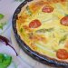

# Quiche Holder

A simple [Lumen](https://lumen.laravel.com/) API for generating placeholder images of the wonderfully versatile, always delectable quiche!

## Usage

Make a GET request to `https://[APPLICATION URL]/[WIDTH]/[HEIGHT]`

## Examples

`https://quiche-holder.local/250/150`

`https://quiche-holder.local/500/175`

`https://quiche-holder.local/75/75`

