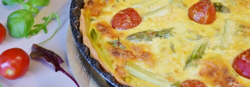

# Quiche Holder

A simple [Lumen](https://lumen.laravel.com/) API for generating placeholder images of the wonderfully versatile, always delectable quiche!

## Usage

Use the `images` endpoint and pass in the desired dimensions: `https://[APPLICATION URL]/images/[WIDTH]/[HEIGHT]`

## Examples

`https://quiche-holder.local/images/250/150`

`https://quiche-holder.local/images/500/175`

`https://quiche-holder.local/images/75/75`

